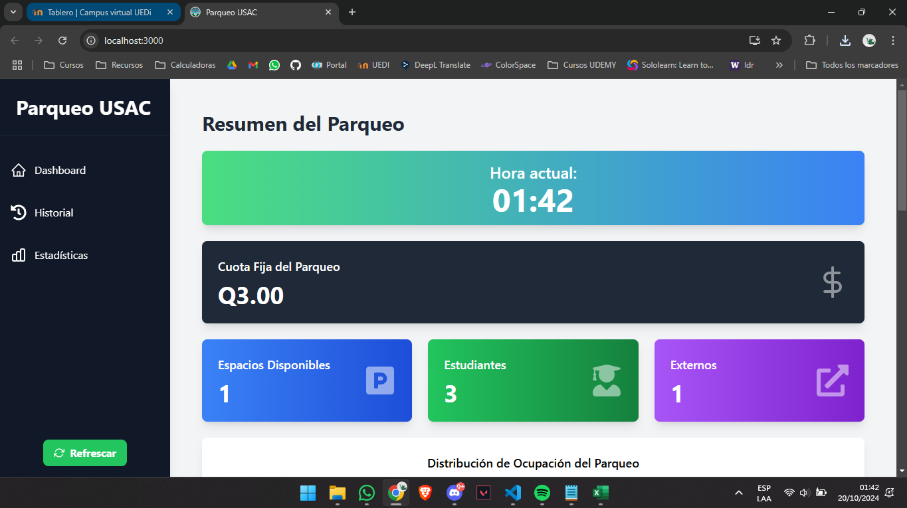
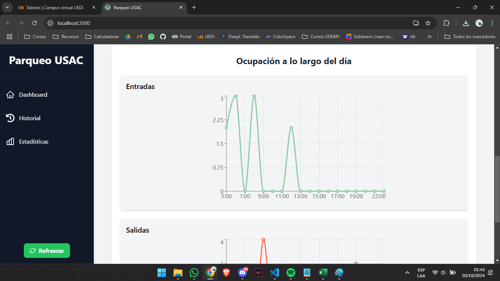
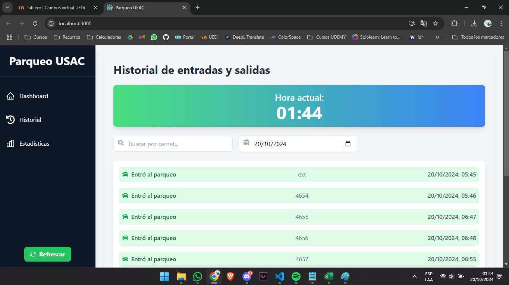
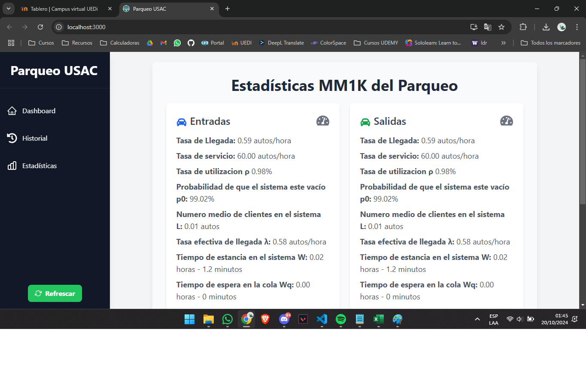

# 🅿️ Panel de Gestión de Parqueo

Bienvenido al Panel de Gestión de Parqueo de la Facultad de Ingeniería en la Universidad San Carlos de Guatemala. Esta aplicación permite monitorear y gestionar el espacio de parqueo de manera eficiente, con actualizaciones en tiempo real, análisis detallados y una interfaz fácil de usar.



---

## 🚀 Funcionalidades

- **Monitoreo en Tiempo Real**: Recibe actualizaciones en vivo sobre los espacios de parqueo disponibles y ocupados.
- **Estadísticas Detalladas**: Realiza un seguimiento de métricas clave como el tiempo promedio de permanencia, tasas de ocupación y más.
- **Visuales Interactivas**: Gráficas y tablas que muestran datos y tendencias del parqueo a lo largo del día.
- **Alertas y Notificaciones**: Recibe notificaciones cuando el parqueo está lleno o cuando se predice un incremento en las salidas.
- **Diseño Responsivo**: Optimizado para dispositivos de escritorio y móviles, asegurando una experiencia de usuario fluida en cualquier dispositivo.

---

## 🛠️ Stack Tecnológico

Este proyecto está construido utilizando las siguientes tecnologías:

- **React**: Una biblioteca de JavaScript para construir interfaces de usuario.
- **Tailwind CSS**: Un framework CSS basado en utilidades para crear diseños altamente personalizables.
- **React Icons**: Una colección de iconos populares para proyectos en React.

---

## 🧑‍💻 Cómo Ejecutar el Proyecto

Sigue estos pasos para ejecutar el proyecto en tu máquina local.

### Requisitos Previos

- **Node.js** y **npm**: Asegúrate de tener Node.js instalado en tu máquina. Puedes descargarlo [aquí](https://nodejs.org/).

### Instalación

1. Clona este repositorio:

    ```bash
    git clone https://github.com/Fercho9134/Proyecto-EMI-IO2-.git
    ```

2. Navega al directorio del proyecto:

    ```bash
    cd parqueo-frontend
    ```

3. Instala las dependencias:

    ```bash
    npm install
    ```

4. Inicia el servidor de desarrollo:

    ```bash
    npm start
    ```

5. Abre tu navegador y dirígete a:

    ```bash
    http://localhost:3000
    ```

---

## 📊 Resumen del Dashboard

El Panel de Gestión de Parqueo consta de varias secciones clave:

### 1. **Resumen Principal**
   Muestra datos en tiempo real sobre la ocupación del parqueo, incluyendo:
   - Espacios disponibles vs. ocupados.

   

### 2. **Gráficas de Ocupación**
   Representaciones visuales de entradas y salidas a lo largo del día, actualizadas cada hora entre las 5 AM y 10 PM. 
   
   

### 3. **Gráfica de Pastel**
   Desglose de la ocupación actual del parqueo en un formato de gráfica de pastel, proporcionando una visión rápida.

   

### 4. **Registro de Entradas/Salidas**
   Una tabla detallada con todas las entradas y salidas de vehículos, incluyendo marcas de tiempo y tipos de vehículos.

   

---

## 📐 Integración del Modelo de Colas MM1K

Este proyecto incluye un análisis obligatorio del modelo de colas MM1K, utilizando datos de entradas y salidas en tiempo real para calcular métricas clave como:
- **Longitud de la cola**.
- **Tiempo de espera**.
- **Tiempo de servicio**.

El modelo usa una tasa de servicio constante y tasas de llegada en tiempo real obtenidas de los datos del parqueo.

 

---

## 🌐 Endpoints de la API

Este proyecto interactúa con tres endpoints principales:

1. **Resumen del Parqueo**: Proporciona un resumen de los espacios disponibles y ocupados.
2. **Entradas**: Rastrea las entradas de vehículos en el parqueo.
3. **Salidas**: Monitorea las salidas de vehículos del parqueo.

Cada endpoint proporciona los datos necesarios para actualizaciones en tiempo real y análisis estadísticos precisos.

---

## 🎨 Estilizado con Tailwind CSS

La interfaz está diseñada utilizando **Tailwind CSS** para asegurar un diseño responsivo y visualmente atractivo. El diseño del dashboard se adapta a diferentes tamaños de pantalla, haciéndolo utilizable tanto en pantallas grandes como en dispositivos móviles.

Aquí hay un ejemplo de cómo se usa Tailwind:

```html
<div class="bg-blue-500 text-white p-4 rounded-lg shadow-md">
    Espacios de Parqueo Disponibles: 42
</div>
